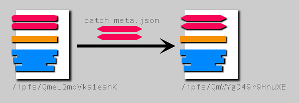
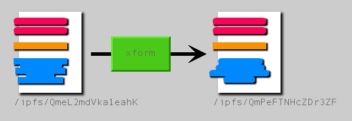
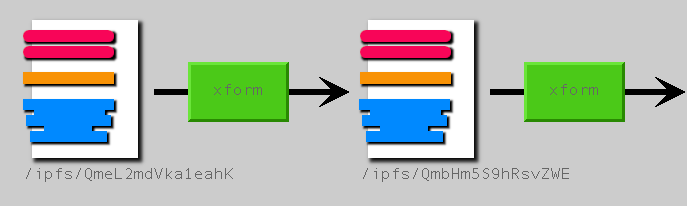
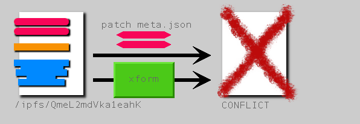
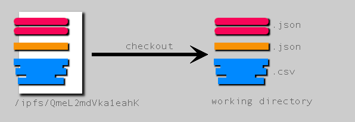

- Feature Name: Save, Dryrun, and Stdout
- Start Date: 2020-04-09
- RFC PR: [#48](https://github.com/qri-io/rfcs/pull/48)
- Issue:

# Summary

Reassessing and understanding how save, dry-run, transforms, and FSI work together.

# Motivation

## Save, Dryrun, and Stdout

Recently, there's been a lot of attention being paid to our save codepath, and some work has begun to dig into it and make it more tractable.

A few days ago, while cleaning up some testing code, I found that when `qri save` writes its message about "dataset saved: [username]/[ds_name]@/ipfs/[full_path]" that message is written to stderr instead of stdout. This seemed to be confusing; we also have purely informational messages like FSI's "for linked dataset..." going to stderr since they're mostly incidental in meaning. The `save` command telling the user what the full reference is seems much more central to its whole purpose.

Looking into why this was happening, I believe the decision was made before FSI existed, and was meant to support transform dry-runs. A command such as this:

```
  qri save --dry-run --file my_transform.star me/my_ds
```

would output the "dataset saved" message to stderr, and the result of the dry-run, which is the dataset's body, to stdout. Then enables piping the body to another program, or saving it to a local file with redirection.

Looking back on this, I don't think this was the best decision. We're affecting the core operation of save and the way it outputs information in order to support a tricky-to-use secondary feature. Furthermore, it's worth asking if this is the correct way to think about developing and introspecting transforms. For the dry-run case, we're confusing `save` which creates commits, with observing and processing the result of a dry-run, which is a read-only operation. The thing we actually care in this case is executing the transform and seeing it's output, not performing a `save`.

At the same time, we have never had a full explanation for how transforms and FSI are supposed to work together, and there's lots of bugs now in how dry-run and transform interact with FSI. We're at a point where we need to re-evaluate how these pieces work together.

Let's go back to the very beginning.

## Manual Save

In the early days, it was decided that the right way to think about a `save` operation on a dataset that already existed was as a "patch application". Let's say I have a dataset named "dustomp/my_ds" that looks like this:


Then I run this command to create a second version:

```
  qri save --file new_meta.json me/my_ds
```

What this means is "take my previous version, and *patch it* by updating the meta component with the contents of this file". Everything else in the dataset stays the same. In this way, a manual save operation acts as a state transition between versions by way of patching the previous to arrive at the next.



## Transforms

When transform scripts were introduced, we needed a similar way to describe the semantics of how they operate. A major question early on was whether a transform living with a dataset should always be reapplied on each save operation, or if it should only be used once, on the commit at which it was added.

We went back and forth on this question, and ultimately arrived at the following functionality: a transform should only be executed on the commit where it gets added, and not every commit in the future, because the resulting dataset may not make sense to use as input to the same transform (think about a transform that adds or removes a column). However, if a user wanted to reapply the same transform, they could opt-in to that functionality by using the `--recall` flag, which would retrieve a recently rerun transform to run again.

This transform changes the shape of the data, so it doesn't make sense to apply it again:


This transform keeps the same shape of the data; running it a second time makes sense:


Similar to a manual save, a transform script represents a state transition, with a reproducible method to execute that state transition, and a mechanism called "recall" to clone that state transition when applicable.

A crucial fact about this description is that a manual save and a transform have the potential to conflict when used at the same time. Since they are both acting as state transitions, we need to ensure that the modifications introduced by each are able to compose together into a single change, in order to fit within our linear history of commits. Neither forking nor merging are allowed:



What this means in practice is that a save operation cannot have both a transform script and a manual change, via patch application, if they are modifying the same component.

```
  qri save --file my_transform.star --file new_meta.json me/my_ds
```

```
def transform(ctx, ds):
  ds.set_meta("title", "New Title")
```

## File System Integration

Introduced next was filesystem integration, which would allow a user to "checkout" a dataset. This creates a "working directory" on their local filesystem which has a link file (.qri-ref) that connects a number of component files (such as meta.json, body.csv) to the dataset that exists within the qri repository. When the user runs `qri save` to create a new version, the files in the working directory are converted into something with the same shape as what's in our repository.

The way this works is that we think of the working directory as being a staging area for a future commit. Since the checked out dataset is not immutable data like that in our repository store, its files are able to be modified. Not until the user issues `qri save` is the working directory turned into a commit; before then it is only a potential future state to transition to:



Furthermore, the type of "patch application" mentioned in the section about "Manual Save" no longer applies. Instead, we need to think about the Working Directory as representing a "full replacement" when a new version is created. So the codepath for `save` knows about both patch applications and full replacements when creating a new commit.

## The Missing Piece

Here are the pieces in place now:

1) A manual save, created by providing file components, adds a commit to a dataset in our repository
2) A transform, which when executed will act as a state transition to a new commit. Might conflict with (1)
3) FSI's full replacement save, which converts the contents of the working directory to a new commit

FSI was designed with a lot of thought put into how it would work in relation to manual saves. However, the combination of transforms within FSI has not been clearly defined. We worked under the assumption that transform authors would use them only with non-checked out datasets. But as time has passed, we've found this no longer to be the case.

One major issue comes from the assumption that transforms need to check for conflicts with manual save operations. Under FSI, since we're no longer performing patch operations, the full set of component files are always there in the working directory. Transforms don't know how to handle this, and detect it as a conflict, which frequently leads to confusing error messages and irreconcilable states.

Getting down to it, there's a fundamental mismatch with how transforms are defined, and how FSI assumes it may operate. Before FSI, there was a one-to-one correlation between running a transform and creating a commit, hence why it made sense to tie that execution to the "save" command. The `--dry-run` flag was acting as a development tool. But with FSI, that original assumption no longer applies. A transform should be able to be executed as a way to modify the body without committing, in fact this is probably going to be the expected behavior for any new user coming to qri.

# Proposal

Transforms should *not* be thought of as equivalent to a state transition to a new commit. They should be viewed literally as a *transform*, from some input to some output, and only sometimes is that performed as creating a commit.

Let's say we add a command `qri apply`, which runs a transform to arrive at some output; but where that output ends up will depend upon the context of the command.

1) When operated in the context of a vanilla dataset in the repository, `apply` can write to stdout, replacing the need for `--dry-run`. In this case, we know that no commit is written, so we can change `save` to write to stdout in other cases.

2) A transform as a state transition can be thought of as a `qri apply` operation piped into the `qri save` command, with appropriate syntacic sugar.

3) For FSI, `qri apply` can modify the body in the working directory, letting the user see the results without messing with the `save` and `--dry-run` comamnds. When they eventually do run `qri save`, we should stash the current body file, apply the transform and verify one of the following:

  * The stashed body matches the output of the transform
  * The stashed body is unchanged from the previous commit, replace it with the transforms' output
  * Otherwise throw an error because the user may be making a mistake, mixing a body from a transform with manual edits
 
4) Not mentioned above, but once Desktop has better support for transform, we probably will eventually want some interactive development environment. Perhaps transforms can be incrementally compiled and applied, resulting in fast turnaround.

To expand on this idea, applying a transform could be generalized out to other tasks that execute some sort of data pipeline. For example, if we bring back viz, generating those visuals could also be seen as a type of apply operation, with the script being some sort of imaging library, and the output being static images. Or, our `qri update` feature could be somehow incorporated into this. Any sort of task that computes using a dataset to produce some view or artifact could be folded into this command. Better to have a generalized tool than create a one-off command that solves only a narrow problem.

Suggestions from @b5 about commands that already exist that could be considered applications:

```
sql
stats
render
```

Maybe also:

```
validate
diff
```

## Caveat

We need to constrain the definition of apply somewhat, so that it doesn't become simply synonymous with "code", and therefore lose all useful meaning. To do that, we need to figure out what's the benefit of defining application, what sort of guarantees do we want from it, as something that acts like running a transform, but is more general.

### How we want application to behave

- Inspiration from functional programming & functional data structures
- A way to wrangle state & control side-effects
- The input should be one or more datasets, plus whatever specific scripts the application requires
- The output of apply should be a dataset or components of a dataset, but not more than one dataset.
- Reproducible
  - capture http (have cloud sign requests)
  - though 2 runs may not technically produce the same thing, we can know *when* and *why* they don't
- Idempotent
  - running the same application twice should be safe
  - Qri should be able to tell that an apply operation was already run
  - Imitate a functional data structure
      * The state transition mentioned higher up still exists, it just doesn't necessarily map to commits all of the time

### What do we gain by making apply more general

- Easy of use is the main thing, a single command to "do stuff"
- Guarantees about reproducability and tracking work without having to spend brain juice
- Avoid the Jupyter notepad "statefulness" problem

### Changes to save codepath

- Need to unwrangle transform out of the primary code path so it's not so coupled
- The `save` command should keep the transform component, instead of removing it after the commit where it gets executed
- that was a consequence of the old way of thinking (--file transform == commit)

# Feedback from users

We noted much confusion about how transform works, especially from @feep and @hbruch. A lot of this inspired and motivated the creation of this RFC. Here are some examples:

Holger complaining about transforms in working directory:

https://discordapp.com/channels/497052800778502152/580806684088336395/693344064732397578

-----

Transform should remain on the dataset, instead of being removed once run:

https://discordapp.com/channels/497052800778502152/580806684088336395/694301952456130757

-----

feep: "Is it possible to separate transforms from commits?"

https://discordapp.com/channels/497052800778502152/580806684088336395/694543025791172668

-----

feep: "What if qri transform was a thing? If you ran it with a linked dataset it would make the changes locally but not commit them."

https://discordapp.com/channels/497052800778502152/580806684088336395/694543113909174273

# User Interface (command-line)

Before, running a transform would happen just by calling `save` with `--file transform.star`. We should add an `apply` command, and saving and applying at the same time should become some special mode of `save`.

### Apply command

```
qri apply xform.star me/my_ds
```

Run the transform, output to stdout, replacing what `--dry-run` does now

----

```
qri apply xform.star me/my_ds -o result.csv
```

Runs the transform, save to file

----

```
qri apply me/my_ds
```

Runs the transform that is stored on the dataset, output to stdout, replacing what `--recall` does now

----

(FSI only) 

```
qri apply
```

Runs the transform in the working directory, save to body file, and also output to stdout.

----

Note that `apply` takes two optional arguments (plus flags). One argument is the transform script, the other is the dataset reference.

### Save command

The `save` command may be combined with `apply` to handle the original use case of creating a new commit by running a transform as a state transition. This takes the form of the `--apply` flag.

Here's the old way of saving with a transform:

```
qri save --file xform.star me/my_ds
```

Under the new paradigm, it's ambiguous what this intention is, the user may be adding a transform they want to run, or adding a transform that they do not want to run. This will henceforth become an error: `saving with a new transform requires either --apply or --no-apply flag`

----

```
qri save --apply --file xform.star me/my_ds
```

Put the transform on this dataset, run it, save a commit

----

```
qri save --no-apply --file xform.star me/my_ds
```

Add the transform, save a commit but don't run it. Only required for the commit that adds the transform; don't need to keep passing `--no-apply` to future `save` commands (unless another transform is added with `--file`).

----

```
qri save --apply me/my_ds
```

Rerun the transform this dataset has attached to it (used to be `--recall`).

----

(FSI only)

```
qri save --apply
```

Run the transform in the working directory, and save the result as a new commit. See "FSI State Tracking" section below.

----

Notice:

`--apply` is a boolean flag, doesn't take a file name

`--no-apply` is also a boolean, only needed when you add a transform file the first time

  - works for both FSI and saving in the repository

### Future possibilities

```
qri apply structure.json me/my_ds
```

Could be treated as an alias for validation

# Implementation

## Applicator

Define an *applicator* as a processor that is able to implement the `apply` command. Some examples:

* starlark runner
* validation
* visualization renderer
* sql engine

input: one or more datasets, applicator specific scripts

output: one dataset, or components of that dataset

## Commit component

The commit component should get a new field that adds information about whether an `apply` operation was used to create this commit. 

For example:

```
type Commit struct {
  ...
  Apply Application
}

type Application struct {
  Name string
  Checksum string
  Path string
  ...
}
```

We should also in the near future add http capture, and put auditable information in the same section. Details to follow in future documents.

## FSI state tracking

Suppose a user has a working directory in a clean state. Nothing has been modified from the head version saved in the repository. When the user runs `status` or `save` we detect that nothing has changed.

```
$ qri status

working directory is clean
```

But then they manually modify the body by appending a row

```
$ echo "new,row,123" >> body.csv
```

By running `status`, they can see that the working directory is now "dirty".

```
$ qri status

  modified: body.csv
```

Running `save` creates a new commit, leaving the working directory in a clean state again.

```
$ qri save

dataset saved: ...
```

When the user runs `apply`, run the transform. The result should both overwrite what is in the body file (to aid in IDE based development) and also output to stdout. If the transform encounters an error, the body should not be modified.

```
$ qri apply
```

Running `qri apply` in an FSI directory should also create a `commit.json` component with the Apply subcomponent filled in. (alternatively, create an `apply.json` subcomponent).

When `apply` is run, if the body is not clean *and* `commit.apply` does not exist, warn the user that they're going to overwrite some manual changes to the body.

When the user runs `qri save`, we must take the following steps:

1) Was either the `--apply` flag used, or a `commit.apply` present? If not go to (5).

2) Is the body dirty? If so, stash it and restore the body from the most recent commit.

3) Apply the transform, saving the result to the body

4) Was something stashed before? If so, compare the stashed value against the result of the transform. If they don't match, display an error. Otherwise, in either case, go to the next step

5) Save a new commit

This above process prevents the user from modifying the body while also `apply`ing a transform. Doing so is error-prone and hard to audit, so we should prevent users from making mistakes like this. They can provide the `--force` flag to proceed anyway if they really want to.
